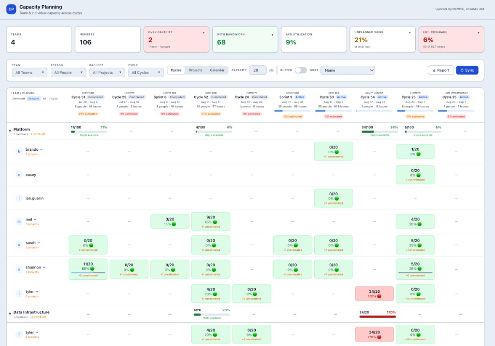
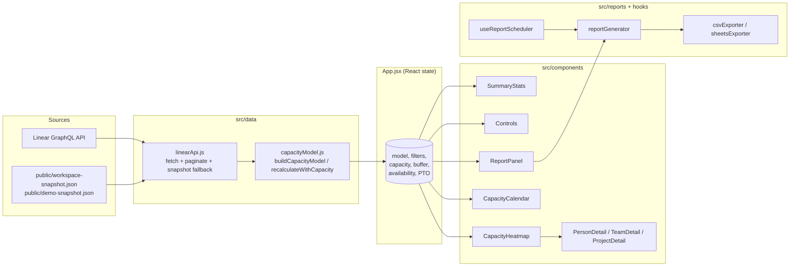

# Capacity Planning Dashboard

A person-centric capacity planning dashboard for Linear. It pulls live workspace data through Linear's GraphQL API and shows how estimated work compares to available capacity at the person, team, and project level.

This is a client-only React app. There is no backend. The browser talks to Linear directly, so it is intended for trusted/internal use, not public deployment.



## Capabilities

### Live Linear data
- Loads teams, members, cycles, projects, and cycle-assigned issues from Linear GraphQL
- Paginates nested team rosters and project lists so large teams are not truncated at 50 records
- Normalizes estimates across Linear estimation types (linear, Fibonacci, exponential, T-shirt)
- Falls back to `public/workspace-snapshot.json` if the live fetch fails, with a cached-data banner
- Optional `?demo=true` mode loads `public/demo-snapshot.json` when that file is present

### Person × cycle capacity
- Heatmap of people (grouped by team) against cycles, colored by utilization
- Default supply of 20 points per person per cycle, adjustable globally without refetching Linear
- Effective capacity formula: `base × availability × (1 − buffer%)`
- Utilization thresholds: on track (≤60%), near capacity (≤85%), at risk (≤100%), over capacity (>100%)
- Click a cell to inspect the calculation: assigned points, effective capacity, planned vs unplanned work, and issues without estimates

### Supply-side inputs
- Per-person, per-cycle PTO days, converted to availability as `(workingDays − ptoDays) / workingDays`
- Manual availability percentage as a proxy for holidays, on-call, or other reduced supply
- Unplanned-work buffer (10–30%) that reduces effective capacity in the UI without changing committed points
- PTO and availability live in session state only; they are not written back to Linear and reset on reload

### Cross-team visibility
- Tracks each person's commitments by issue team, not only their home-team roster
- Heatmap includes people who contribute to a team without being formal members
- Person detail shows a team-commitment split for the selected cycle
- Team detail shows borrowed-in / borrowed-out points and effective FTE
- Cross-team members are marked in the grid so managers can spot people who look free in one team and loaded elsewhere

### Team and project inspection
- Summary KPIs: team count, member count, over-capacity people/teams, average utilization, unplanned-work share, estimation coverage
- Team detail: member utilization comparison, planned vs unplanned mix, project breakdown, utilization trajectory
- Project view: people × projects, cycle status (active / upcoming / past / unplanned), delivery vs elapsed time
- Project risk signals: single-owner, high unplanned ratio, low estimation coverage, stalled completions, heavy backlog

### Month and quarter calendar
- Calendar view combines commitments from overlapping team cycles into one person-level timeline
- Month mode shows weekly columns; quarter mode shows monthly columns
- Cycle estimates are prorated by the working days that overlap each calendar period
- Supply uses the global points-per-cycle setting normalized to a 10-working-day cycle, without double-counting concurrent cycles
- Column headers list overlapping cycle names; click a week or month to open the full cycle list above the grid, grouped by team with dates and weekday overlap
- Person cells show prorated points plus short cycle chips (`C53 9`, `S8 3`); click a cell for contributing cycles, team commitments, project demand, and unestimated work
- PTO and manual availability reduce period supply and appear as badges in calendar cells
- Team groups are collapsible: click a team summary row to hide or show that team's people while keeping the team totals
- Calendar respects team, person, project, cycle, capacity, buffer, and sort controls

### Filtering and sorting
- Filters: team, person, project, cycle
- Views: Cycles, Projects, or Calendar
- Sort: name, utilization, remaining bandwidth, or points (project and calendar views)

### Reporting
- Slide-over report preview generated from the same in-memory model
- CSV export
- Optional Google Sheets export when `VITE_GOOGLE_CLIENT_ID` is set
- Optional scheduled refresh/export via the report scheduler

## Limitations

These are current boundaries, not roadmap items:

- Only issues assigned to a cycle are included in capacity math. Backlog and unscheduled project work do not consume capacity.
- The cycle window is active cycles plus cycles that ended in the last 30 days. Future cycles are not fetched.
- There is no holiday calendar, on-call rotation, or native Linear PTO source.
- Calendar supply assumes the configured per-cycle capacity represents 10 working days. PTO remains cycle-scoped rather than date-scoped.
- Quarter views only include cycles present in the current API window, so they are not yet a complete forward-looking quarterly plan.
- Scenario planning (staffing changes, date shifts, scope edits, dependencies, write-back to Linear) is not implemented.
- The Linear API key is a `VITE_` env var, so it is visible to anyone who can load the app.

## Setup

```bash
npm install
```

Create a `.env` file in the root:

```
VITE_LINEAR_API_KEY=lin_api_xxxxx
```

Optional:

```
VITE_GOOGLE_CLIENT_ID=xxxxx.apps.googleusercontent.com
```

## Running

```bash
npm run dev
```

Open http://localhost:5173

## Discovery Script

To explore your workspace structure and generate a fallback snapshot:

```bash
LINEAR_API_KEY=lin_api_xxxxx node src/data/discover.js
```

Then copy `src/data/workspace-snapshot.json` to `public/workspace-snapshot.json` for the app fallback.

## Architecture

The app is a single-page React client. There is no backend — the browser talks to Linear's GraphQL API directly, normalizes the response into one in-memory capacity model, and renders every view from that model.



**Component tree at runtime:**

```
App
├── SummaryStats          # KPI cards, over-capacity teams
├── Controls              # team/person/project/cycle filters, capacity slider, buffer
├── CapacityHeatmap       # Cycles/Projects grids: people × cycles or projects
│   ├── PersonDetail      # drill-in: projects, issues, cross-team commitments
│   ├── TeamDetail        # drill-in: rebalancing view
│   └── ProjectDetail     # drill-in: scope, risk, delivery
├── CapacityCalendar      # month/quarter timeline: prorated load, collapsible teams
└── ReportPanel           # slide-over: preview, CSV/Sheets export, scheduler
```

## Key design decisions

1. **Client-only SPA, no backend.** The browser calls Linear's GraphQL endpoint directly using `VITE_LINEAR_API_KEY`. Zero infra to run, instant deploy as static files. Trade-off: the API key is exposed to the browser, so this is intended for trusted/internal use, not a public deployment.

2. **One canonical in-memory model.** `buildCapacityModel` in `src/data/capacityModel.js` is the single source of truth. It normalizes teams, cycles, projects, and issues; aggregates per-person per-cycle commitment; tracks cross-team work; and computes utilization. Every UI component reads from this model — no component re-derives capacity from raw issues.

3. **Snapshot fallback baked into the data layer.** If the live fetch fails, `loadSnapshot()` transparently loads `public/workspace-snapshot.json` and the UI shows an amber "cached data" banner. This makes the app demo-resilient and offline-tolerant without special code paths in components.

4. **Demo mode via query string.** `?demo=true` forces loading `public/demo-snapshot.json` and skips the live fetch entirely. Lets you demo against curated data without touching `.env` or the network.

5. **Capacity recomputes without refetching.** Moving the capacity slider triggers `recalculateWithCapacity` on the existing model instead of re-querying Linear. Keeps interaction snappy and avoids burning API quota on what is effectively a view-level knob.

6. **PTO is modeled as availability, not as a separate entity.** Setting PTO days for a person/cycle derives an availability fraction `(workingDays - ptoDays) / workingDays`, which then feeds utilization. One concept, not two.

7. **Buffer is a view-time multiplier, not a data mutation.** The "unplanned work buffer" toggles effective capacity in the UI layer; the underlying model and committed points are unchanged. Easy to reason about, easy to turn off.

8. **Pagination handled at the data layer.** `paginateAll()` / `paginateConnection()` in `linearApi.js` walk GraphQL cursors so components never see partial data. Issues are fetched in pages of 50, filtered to those with a cycle. Team members and projects are paginated separately because nested Linear connections cap at 50.

9. **Reports are a side channel.** Report generation, CSV/Sheets export, and the scheduler live in `src/reports` and `src/hooks/useReportScheduler.js`, decoupled from the heatmap. They consume the same model the UI does.

10. **Linear-inspired visual design.** Tailwind v4 with CSS custom properties (`var(--accent-blue)`, etc.) and a fixed 1800px max width — designed to feel native to Linear users who will be reading this alongside Linear itself.
